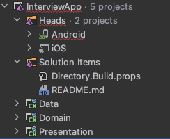

TrackMan Interview App
----------------------

For design files and description look in: https://www.figma.com/file/aGUvPYzb6DycpcGnC1I6C9/Design-Task

## Getting started

1. Install the .NET SDK 9.0.300 or newer from https://dotnet.microsoft.com/en-us/download/dotnet/9.0
2. Install the two workloads `ios` and `android`: `sudo dotnet workload install ios android --version 9.0.300`
3. Other dependencies required:
  - For Android:
    - Make sure to have Java SDK 17 installed or newer and `JAVA_HOME` env variable set. Could look like: `/Library/Java/JavaVirtualMachines/microsoft-17.jdk/Contents/Home`
    - Make sure to have the Android SDK installed with API 34 SDK installed
  - For iOS:
    - Make sure to have Xcode 16.4 or newer installed

You can use either JetBrains Rider or VS Code to run and edit the code. If you use VS Code, install the suggested extensions when you open this folder.

## Baseline App

The basic structure of the App is as follows

There are 2 "heads" one for Android and one for iOS. These are the Applications that actually get compiled and run on the devices.

They are Xamarin.iOS and Xamarin.Android Applications, without any frameworks installed.

The project structure is a layered structure:

- Domain contains entities and interfaces
- Data contains the data layer that fetches data from APIs
- Presentation layer consumes Domain and Data layer to prepare and present data to the user

The heads consume all of these projects.

### iOS

### Android

### Data
Data we want you to consume can be found here: https://tminterview.blob.core.windows.net/golf/friends.json

You can make the assumption that if a `IsFriend` = `false` it is a recently played with user.

## Notes
Remember we do not expect pixel perfect code, idiom specific UI is OK.
